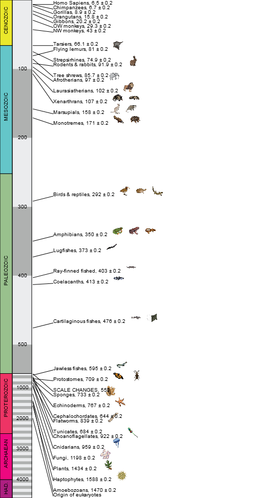

# Timeline.js
Display evolutionary history from the beginning of earth time on an HTML5 canvas



## Example
```html
<canvas id="canvas" width="500" height="970"></canvas>
<script type="text/javascript">
	var timeline = new Timeline([{"id":-1,"name":{"scientific":"Origin of eukaryotes","common":null},"branch":{"length":2000,"correction":0, "noshow":true},"figurines":[]},{"id":-1,"name":{"scientific":"Haptophytes","common":null},"branch":{"length":1588,"correction":0.2},"figurines":["../images\/timetree\/55410_Pseudopediastrum_boryanum.png"]},{"id":-1,"name":{"scientific":"Amoebozoans","common":null},"branch":{"length":1470,"correction":0.2},"figurines":[]},{"id":-1,"name":{"scientific":"Plants","common":null},"branch":{"length":1434,"correction":0.2},"figurines":["../images\/timetree\/3512_Quercus_rubra.png"]},{"id":-1,"name":{"scientific":"Fungi","common":null},"branch":{"length":1198,"correction":0.2},"figurines":["../images\/timetree\/143960_Coelomomyces_stegomyiae.png"]},{"id":-1,"name":{"scientific":"Choanoflagellates","common":null},"branch":{"length":922,"correction":0.2},"figurines":["../images\/timetree\/81824_Monosiga_brevicollis.png"]},{"id":-1,"name":{"scientific":"Sponges","common":null},"branch":{"length":733,"correction":0.2},"figurines":["../images\/timetree\/178540_Callyspongia_vaginalis.png"]},{"id":-1,"name":{"scientific":"Cnidarians","common":null},"branch":{"length":959,"correction":0.2},"figurines":["../images\/timetree\/6145_Aurelia_aurita.png"]},{"id":-1,"name":{"scientific":"Flatworms","common":null},"branch":{"length":839,"correction":0.2},"figurines":["../images\/timetree\/27890_Dugesia_subtentaculata.png"]},{"id":-1,"name":{"scientific":"Protostomes","common":null},"branch":{"length":709,"correction":0.2},"figurines":["../images\/timetree\/13037_Danaus_plexippus.png","../images\/timetree\/433262_Pelecotoma_fennica.png"]},{"id":-1,"name":{"scientific":"Echinoderms","common":null},"branch":{"length":767,"correction":0.2},"figurines":["../images\/timetree\/7604_Asterias_rubens.png"]},{"id":-1,"name":{"scientific":"Cephalochordates","common":null},"branch":{"length":644,"correction":0.2},"figurines":[]},{"id":-1,"name":{"scientific":"Tunicates","common":null},"branch":{"length":684,"correction":0.2},"figurines":[]},{"id":-1,"name":{"scientific":"Jawless fishes","common":null},"branch":{"length":595,"correction":0.2},"figurines":["../images\/timetree\/7757_Petromyzon_marinus.png"]},{"id":-1,"name":{"scientific":"Cartilaginous fishes","common":null},"branch":{"length":476,"correction":0.2},"figurines":["../images\/timetree\/57989_Odontaspis_ferox.png","../images\/timetree\/87140_Aetobatus_narinari.png"]},{"id":-1,"name":{"scientific":"Ray-finned fished","common":null},"branch":{"length":403,"correction":0.2},"figurines":["../images\/timetree\/36177_Acipenser_oxyrinchus.png"]},{"id":-1,"name":{"scientific":"Coelacanths","common":null},"branch":{"length":413,"correction":0.2},"figurines":["../images\/timetree\/7897_Latimeria_chalumnae.png"]},{"id":-1,"name":{"scientific":"Lugfishes","common":null},"branch":{"length":373,"correction":0.2},"figurines":["../images\/timetree\/7883_Lepidosiren_paradoxa.png"]},{"id":-1,"name":{"scientific":"Amphibians","common":null},"branch":{"length":350,"correction":0.2},"figurines":["../images\/timetree\/197464_Agalychnis_callidryas.png","../images\/timetree\/129016_Micrixalus_fuscus.png","../images\/timetree\/291264_Rhyacotriton_variegatus.png"]},{"id":-1,"name":{"scientific":"Birds & reptiles","common":null},"branch":{"length":292,"correction":0.2},"figurines":["../images\/timetree\/118793_Rostratula_benghalensis.png","../images\/timetree\/428006_Podocnemis_lewyana.png","../images\/timetree\/8551_Heloderma_horridum.png"]},{"id":-1,"name":{"scientific":"Monotremes","common":null},"branch":{"length":171,"correction":0.2},"figurines":["../images\/timetree\/9258_Ornithorhynchus_anatinus.png","../images\/timetree\/9261_Tachyglossus_aculeatus.png"]},{"id":-1,"name":{"scientific":"Marsupials","common":null},"branch":{"length":158,"correction":0.2},"figurines":["../images\/timetree\/9317_Macropus_giganteus.png","../images\/timetree\/9267_Didelphis_virginiana.png"]},{"id":-1,"name":{"scientific":"Xenarthrans","common":null},"branch":{"length":107,"correction":0.2},"figurines":["../images\/timetree\/9361_Dasypus_novemcinctus.png","../images\/timetree\/71006_Myrmecophaga_tridactyla.png"]},{"id":-1,"name":{"scientific":"Laurasiatherians","common":null},"branch":{"length":102,"correction":0.2},"figurines":["../images\/timetree\/9689_Panthera_leo.png"]},{"id":-1,"name":{"scientific":"Afrotherians","common":null},"branch":{"length":97,"correction":0.2},"figurines":["../images\/timetree\/9785_Loxodonta_africana.png"]},{"id":-1,"name":{"scientific":"Rodents & rabbits","common":null},"branch":{"length":91.9,"correction":0.2},"figurines":["../images\/timetree\/9986_Oryctolagus_cuniculus.png"]},{"id":-1,"name":{"scientific":"Tree shrews","common":null},"branch":{"length":85.7,"correction":0.2},"figurines":[]},{"id":-1,"name":{"scientific":"Flying lemurs","common":null},"branch":{"length":81,"correction":0.2},"figurines":["../images\/timetree\/482537_Galeopterus_variegatus.png"]},{"id":-1,"name":{"scientific":"Strepsirhines","common":null},"branch":{"length":74.9,"correction":0.2},"figurines":[]},{"id":-1,"name":{"scientific":"Tarsiers","common":null},"branch":{"length":66.1,"correction":0.2},"figurines":[]},{"id":-1,"name":{"scientific":"NW monkeys","common":null},"branch":{"length":43,"correction":0.2},"figurines":[]},{"id":-1,"name":{"scientific":"OW monkeys","common":null},"branch":{"length":29.3,"correction":0.2},"figurines":[]},{"id":-1,"name":{"scientific":"Gibbons","common":null},"branch":{"length":20.2,"correction":0.2},"figurines":[]},{"id":-1,"name":{"scientific":"Orangutans","common":null},"branch":{"length":15.8,"correction":0.2},"figurines":[]},{"id":-1,"name":{"scientific":"Gorillas","common":null},"branch":{"length":8.9,"correction":0.2},"figurines":[]},{"id":-1,"name":{"scientific":"Chimpanzees","common":null},"branch":{"length":6.7,"correction":0.2},"figurines":[]},{"id":-1,"name":{"scientific":"Homo Sapiens","common":null},"branch":{"length":6.5,"correction":0.2},"figurines":[]}]);
	timeline.render(document.getElementById('canvas'), { // takes an object which specifies callbacks
		'onclick': function(org) {
			alert("Clicked on " + org.name.scientific);
		},
		'onhover': function(org) {
			console.log("Mouse hovering over " + org.name.scientific);
		}
	});
</script>
```

## Specifying organisms
Organisms are passed as an array of anonymous objects with the following attributes:
  * **id:** NCBI ID or -1
  * **name:** Name of organism to use as label
  * **branch**
    * **length:**  Evolutionary time for this organism, in MYA (millions of years ago)
	* **correction:** +- correction for time estimate
	* **noshow:** Don't display time in the label
  * **figurines:** An array of paths to images to show for this label 

## Building a Timeline
### Constructor
To build a new timeline, just pass an array of organisms (as defined above) to the Timeline constructor

### Rendering
The render function takes the canvas element where the timeline is to be drawn as the first parameter,
and optionally takes an events object as the second parameter, which can define callbacks for events.
Event callbacks are passed the organism which fired the event (with the organism structure as defined
above), the event itself, and the label row the organism belongs to (from label-dodge).
The following events can be handled:
  * **onclick:** event fired when an organism on the timeline is clicked
  * **onhover:** event fired when an organism on the timeline is hovered over